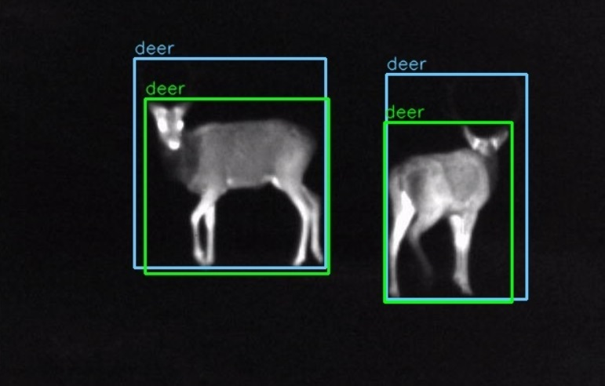
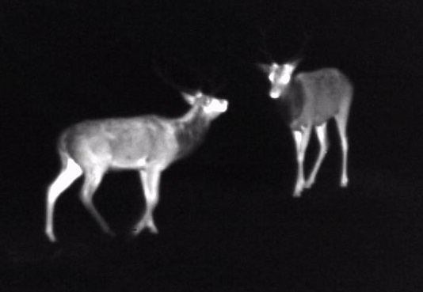

# Automation-of-animal-detection-in-thermal-camera-image



Wild animals are active at night, needing special equipment for study. Monitoring creates extensive data requiring specific analysis. The repository contains the extensive study of topic analyzing thermal images with advanced segmentation technic. Methods like Falzenszwalb segmentation and YOLOv3 neural network transfer learning are compared. The study enhances results using advanced YOLO versions, optimizing via genetic algorithms. All uploaded materials were utilised for master thesis on Warsaw University of Technology, Faculty - Eletronics an Information Technology. The title of the thesis is: "Automatization of animal detection in thermal camera images"

# Structure of repository

The repository is divided into directories according to the detection methods used in the course of the project: data used, classical methods, the use of Faster R-CNN/YOLOv3 neural networks, and hyperparameter optimization in the YOLOv5 architect. The following sections provide an abbreviated description of the content and how to run each module.

## Dataset

A key element in the process of validating detection methods was the creation of a representative dataset to compare solutions in terms of training and effectiveness. Since there are no publicly available datasets that include thermal images of animals, it was necessary to create our own. Acquisitions were carried out in two regions of Poland: the Gostynin-Wloclawek Landscape Park (Mazovia), the Knyszynska Forest (Podlasie). Due to the short duration of the study and the insufficient number of unique captures of different species, it was decided to divide the dataset into 2 classes: wild hogs labeled ''wild boar'' and deer, hereinafter labeled ''deer'' which included deer, roe deer and fallow deer. The next step was the process of annotating the photos. For this, the LabelMe program was used. This program allows users to manually tag the perimeters around silhouettes, which then serve as a reference during the training process. The annotation itself is saved to .xml format, where the tags contained information about the size of the photo, the location and size of the envelope, and the class of the object that was marked. The annotation process was carried out manually by the author of this paper, along with two other people, in order to provide a suitable dataset for the subject being pursued at the Warsaw University of Technology - Semantic Analysis of Images. In the end, 400 grayscale images were obtained - 150 with images containing and ''wild_boar'' class and 250 containing the ''deer'' class. The entire acquisition process of making the dataset was carried out for the purpose of this paper by the author. The example of image is shown below.



## Classical segmentation
Classical methods were intended as an alternative to computationally expensive during transfer learning of neural networks. In the block diagram below, the general idea used to obtain the bounding boxes containing animal silhouettes is presented.

### How to lauch?

1. Clone repository to your local computer
2. Use command

```
pip install -r HOG-SVM/requirements.txt
```

to make sure if all dependencies are installed.
3. To check effects of method using command try:

```
python .\HOG-SVM\hog_svm.py file_name
```

There are two files with .xls bounding-boxes to use. If Someone want to use own file, first of all it should be added to file with examples.

### Short description of files:

- find_ROI.py - contains algorithms to obtain ROI utilising Falzenszwalb's method
- data_gene.py - contains methods to increse size of dataset (obsolete)
- hog_svm.py - main file responsible for training solution
- plot.py - contains method to plot using matplotlib
- generate_ground_truth.py - contains method to transform .xml files to YOLO cordinates, which are easier to mark on image
- 128x128 - catalog with slightly decresed number (5 by class) of samples for training.

## YOLOv5 
In this folder are gathered in three notebooks:
- OldDataset2YoloFormat.ipynb -responsible for changing format from xml from Labelme
- YOLOv5_baseline_dataset.ipynb -responsible for traning, testing and visualising predictions (Attention! The data were hidden for puprpose. To use command !gdown pls contact with author via mail for key)
- Plot_Yolov5_results.ipynb - for plotting results gained during training


## Dataset
